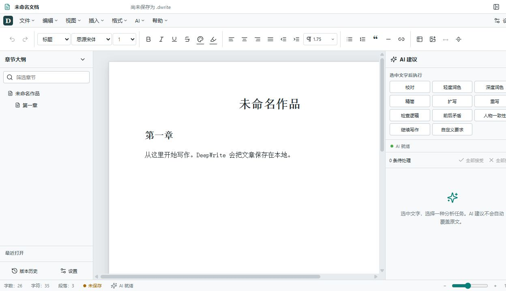

# DeepWrite Desktop

DeepWrite 是一个 local-first 的 Windows 长篇写作桌面软件。它提供接近传统文字处理器的富文本编辑体验，并把 DeepSeek 写作分析作为可选择、可审阅、可拒绝的修改建议，而不是让模型直接覆盖原文。

> 当前状态：`0.1.0` 第一阶段可运行产品。核心编辑、独立 `.dwrite` 文档、安全保存、恢复、版本历史、DeepSeek 结构化建议、基础 DOCX 导入/导出已经实现。复杂 Word 排版、精确分页和完全无损 round-trip 不在本阶段保证范围内。

## 主要功能

- Tiptap 开源核心富文本编辑：正文、Heading 1–3、字体/字号、粗体、斜体、下划线、删除线、颜色、高亮、四种对齐、缩进、行距、列表、引用、链接、水平线。
- 表格操作：插入，增加/删除行列，删除表格。
- 本地图片：插入 data URI 图片和基础宽度缩放。
- 自定义分页符节点；打印时转换为真正的 page break。
- Windows 快捷键：`Ctrl+N/O/S/Shift+S/Z/Y/F/H/B/I/U`，以及标准剪切、复制、粘贴、全选。
- `.dwrite` 独立 JSON 文档，正文不依赖 SQLite 才能恢复。
- 同目录临时文件 + Windows `MoveFileExW` replace/write-through 安全写入。
- 1.5 秒防抖自动保存、异常 recovery、最近文件、可恢复版本历史。
- DeepSeek API Key 由用户在设置中填写；Stronghold 主密码由 Windows 凭据管理器保护，Key 保存在 Stronghold 加密保险库。
- DeepSeek JSON Output + Zod 严格 runtime validation；失败自动修复/重试一次。
- 校对、轻/深度润色、精简、扩写、重写、逻辑、矛盾、人物一致性、续写、自定义要求。
- suggestion 原文删除线 + 新增双下划线/背景标记；接受、拒绝、全部接受、全部拒绝。
- 文档 ID、revision、selection identity、原文 hash 并发保护；原文变化后建议标记为过期，禁止直接覆盖。
- 停笔自动分析（关闭/1/3/5/10/15 分钟），相同 hash 不重复调用，只发送近期段落并遵守上下文上限。
- 导入 `.dwrite/.docx/.txt/.md/.html`，导出 `.dwrite/.docx/.txt/.md/.html`，支持系统打印/PDF。

## 截图



实现截图保存在 `docs/screenshots/main-window.png`，视觉设计基准保存在 `docs/screenshots/deepwrite-concept.png`。

## 技术架构

```text
React + TypeScript + Vite
  ├─ Tiptap / ProseMirror：编辑器、表格、自定义分页符与 suggestion decorations
  ├─ Zod：.dwrite 与 AI JSON runtime validation
  ├─ Mammoth：DOCX → HTML → Tiptap
  ├─ docx：Tiptap JSON → DOCX
  └─ Tauri JS plugins：Dialog / SQL / Stronghold

Tauri 2 / Rust
  ├─ 安全原子写入与 recovery 文件
  ├─ DeepSeek HTTPS 请求（不记录 Key 或正文）
  ├─ Stronghold + Windows Credential Manager
  └─ SQLite migrations：最近文件、设置、版本、AI 建议索引、历史信息
```

程序不包含服务器、账号系统、云同步、多人协作或遥测。

## Windows 开发环境要求

- Windows 10/11 x64
- Node.js 22+
- pnpm 11+
- Rust stable（通过 rustup，MSVC target）
- Microsoft Visual Studio 2022 Build Tools，包含“使用 C++ 的桌面开发”与 Windows SDK
- Microsoft Edge WebView2 Runtime
- 构建 MSI 时需要 WiX（Tauri 会按其工具链要求处理）

参考 [Tauri 2 Windows prerequisites](https://v2.tauri.app/start/prerequisites/)。

## 安装依赖

```powershell
pnpm install
pnpm approve-builds esbuild
```

项目使用 `pnpm-lock.yaml`。不要无理由改用 Bun。

## 开发运行

```powershell
pnpm tauri dev
```

仅预览 Web 前端（文件系统、SQLite、Stronghold 和 DeepSeek Rust 命令不可用）：

```powershell
pnpm dev
```

## 测试和检查

```powershell
pnpm typecheck
pnpm lint
pnpm test
cargo test --manifest-path src-tauri/Cargo.toml
cargo check --manifest-path src-tauri/Cargo.toml
```

测试覆盖文档序列化、损坏/未来 schema 拒绝、AI response schema、hash/stale suggestion、停笔分析去重、自动保存防抖和基础 DOCX 导出。

## Production 构建

```powershell
pnpm build
pnpm tauri build
```

Windows 安装包输出在：

- `src-tauri/target/release/bundle/nsis/`
- `src-tauri/target/release/bundle/msi/`（需要可用的 WiX 工具链）

## DeepSeek API 设置

项目**不会附带 DeepSeek API Key**。用户必须自行提供自己的 Key。

1. 启动 DeepWrite。
2. 打开“设置 → AI”。
3. 在 DeepSeek API Key 中填写 Key，点击“保存 / 修改 Key”。
4. 使用“测试连接”；界面只显示成功/失败和经过限制的错误信息。
5. 默认快速模型为 `deepseek-v4-flash`，默认深度模型为 `deepseek-v4-pro`。

API Base URL 固定为 `https://api.deepseek.com/`，通过 OpenAI-compatible Chat Completions API 调用。`deepseek-chat` 和 `deepseek-reasoner` 不在允许模型列表中。

Key 不写入源码、`.env` 或 SQLite。DeepWrite 不在 console 或错误日志中输出 Key。

## 数据保存位置

- 文章：用户选择的 `.dwrite` 文件位置；它是可独立读取和恢复的格式。
- 本地应用数据：Windows `%LOCALAPPDATA%` 下 Tauri 为 `com.deepwrite.desktop` 分配的应用目录。
- SQLite：`deepwrite.db`，只存最近文件、设置、版本/建议索引和历史信息。
- Stronghold：`deepwrite.vault.hold`；保险库主密码由 Windows Credential Manager 保存。
- 异常恢复：应用数据目录中的 `recovery/pending.dwrite`，正常保存后清理。

这些用户数据均被 `.gitignore` 排除。

## 隐私说明

文章默认仅保存在本地。只有用户主动执行 AI 功能，或明确开启“停笔自动分析”后，相关选区、有限前后文、章节摘要和作者规则才会发送到用户配置的 DeepSeek API。DeepWrite 默认不保存包含完整正文的请求日志，不包含遥测，也不向项目维护者发送数据。

## DOCX 兼容边界

DOCX 导入基于 Mammoth，重点保留语义结构：普通段落、Heading 1–3、粗体、斜体、列表、链接、基础表格，以及 Mammoth 能稳定提取的图片。DOCX 导出覆盖段落、标题、粗体、斜体、下划线、对齐、列表、基础表格、data URI 图片和分页符。

复杂 Word 排版不能保证 100% round-trip fidelity。页眉页脚、修订模式、文本框、SmartArt、复杂浮动对象、宏、精确字体度量、分节与版式、域、脚注/尾注、目录域和高级表格样式可能被简化或丢失。本项目不宣称完全兼容 Microsoft Word。

## Security

- 禁止提交真实 API Key、用户数据库、Stronghold vault、用户文档、recovery、日志正文和构建缓存。
- Rust DeepSeek 客户端固定 HTTPS endpoint、限制允许模型和响应错误长度。
- AI 响应必须通过严格 Zod schema；无效 JSON 永不修改正文。
- AI 建议接受前重新校验目标文本 hash；过期建议只能查看/复制。
- 保存使用临时文件、flush/sync 与同卷 replace，避免破坏唯一正文。
- 发布前运行 `git grep` 和合理的 secret pattern 扫描。

安全问题请避免在公开 issue 中包含真实 Key 或私人正文。

## Roadmap

- 更完善的 DOCX 图片尺寸、编号层级与样式映射。
- 多页视觉布局、页眉页脚和更可靠的打印预览。
- 更细粒度的 block identity/rebase 机制。
- 文档级人物/地点设定库与章节摘要管理。
- 可选的本地全文搜索和版本差异对比。
- 无障碍与键盘导航深度审计。

## License

MIT。直接依赖均来自 npm/crates.io 的公开软件包；发布前应随 lockfile 重新执行依赖许可证清单检查。
